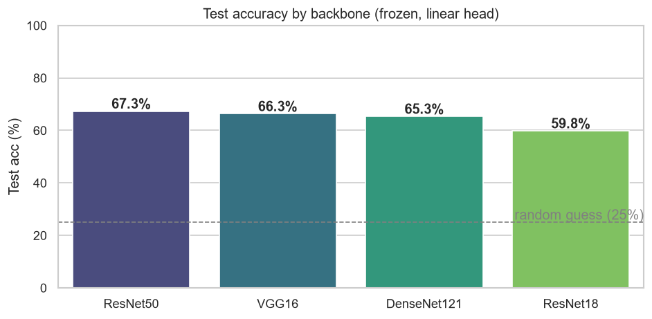
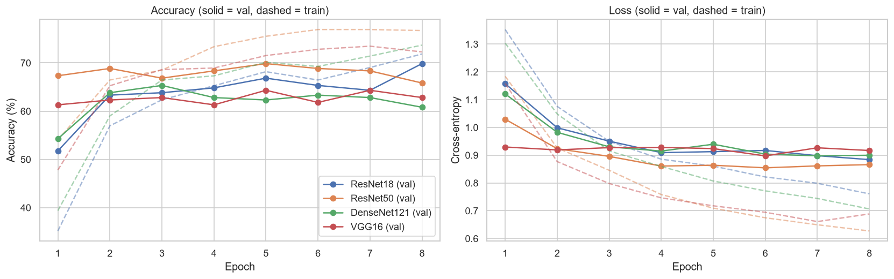
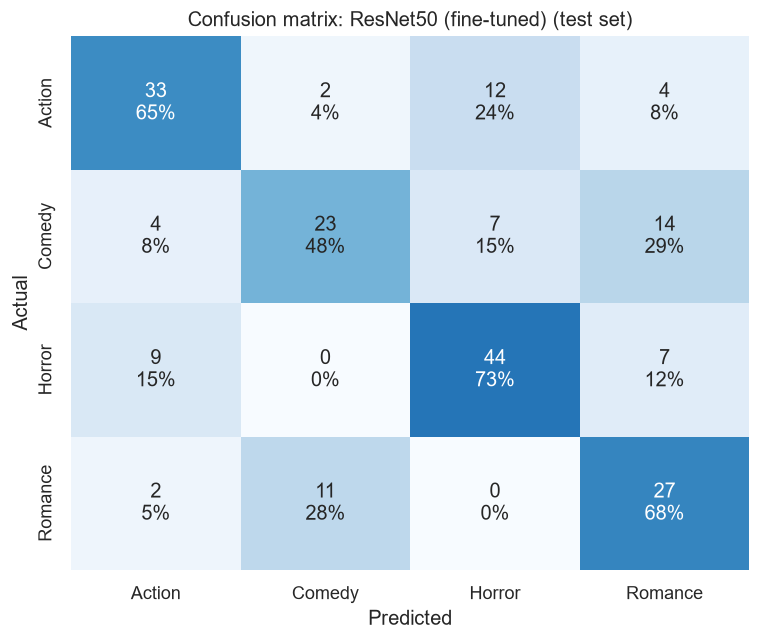

# Movie Genre Classification from Posters

[](https://colab.research.google.com/github/RachitSethi2455/movie-genre-poster-classification/blob/main/movie_genre_classification.ipynb)


Can a CNN tell a movie's genre from its poster alone? This project classifies posters as **Action, Comedy, Horror or Romance** with transfer learning in PyTorch. It compares four ImageNet-pretrained backbones under one identical training setup, then fine-tunes the best one.

**Result:** every backbone lands at about **60–67% test accuracy, roughly 2.5× the 25% random baseline**. ResNet50 is the strongest frozen feature extractor (67.3%). The final model is ResNet50 with its last block fine-tuned (63.8% test accuracy, 0.63 macro-F1). It was chosen on validation accuracy, and its gap to the frozen ResNet50 is within the noise of a 199-image test set.



## Approach

| | |
|---|---|
| **Data** | [Four-Genre Movie Poster Images](https://www.kaggle.com/datasets/zulkarnainsaurav/four-genre-movie-poster-images) (Kaggle, Apache 2.0): 1,325 IMDB posters (Action 337, Comedy 321, Horror 398, Romance 269) |
| **Split** | Stratified 70 / 15 / 15 → 927 train / 199 val / 199 test (seed 42), created reproducibly by the notebook |
| **Preprocessing** | Resize to 224×224 and apply ImageNet normalization. Training-time augmentation: horizontal flip, ±10° rotation and colour jitter. |
| **Stage 1** | Freeze each backbone completely and train a new linear 4-class head. Adam, lr 1e-3, 8 epochs, batch size 32. |
| **Stage 2** | Unfreeze the last block of the stage-1 winner (`layer4` for ResNet50) and train it with the head at lr 1e-4 for 6 epochs |
| **Model selection** | Each run keeps its best-**validation** checkpoint. Backbones are compared on validation accuracy, with ties broken by validation loss. The test set is never used to make a choice. |

## Results

**Stage 1: frozen backbones, linear head**

| Backbone | Trainable / total params | Best val acc | Test acc | Test macro-F1 |
|---|---|---|---|---|
| **ResNet50** | 8.2K / 23.5M | **69.8%** | **67.3%** | **0.666** |
| VGG16 | 16.4K / 134.3M | 64.3% | 66.3% | 0.649 |
| DenseNet121 | 4.1K / 7.0M | 65.3% | 65.3% | 0.642 |
| ResNet18 | 2.1K / 11.2M | 69.8% | 59.8% | 0.581 |

ResNet18 and ResNet50 tie on validation accuracy (139/199 correct each), so the tie is broken by validation loss: ResNet50 has 0.864 against ResNet18's 0.884.

**Stage 2: fine-tuning ResNet50's last block**

| Model | Best val acc | Test acc | Test macro-F1 |
|---|---|---|---|
| ResNet50 (frozen) | 69.8% | 67.3% | 0.666 |
| **ResNet50 (fine-tuned) ← final** | **70.9%** | 63.8% | 0.629 |

Fine-tuning about 15M parameters on 927 images **overfits quickly**. Training accuracy reaches 94% while validation loss rises after epoch 1. The epoch-2 checkpoint was slightly better on validation (70.9% / 0.849 loss) and is the final model by protocol, but it scores 3.5 points lower on test. That difference is **7 posters**, well inside the ±6.6-point 95% confidence interval of a 199-image test set. Selecting the frozen model after seeing this would mean choosing on the test set.



**Per-class results (final model, test set)**

| Genre | Precision | Recall | F1 |
|---|---|---|---|
| Action | 0.69 | 0.65 | 0.67 |
| Comedy | 0.64 | 0.48 | 0.55 |
| Horror | 0.70 | 0.73 | **0.72** |
| Romance | 0.52 | 0.68 | 0.59 |



## Findings

- **Horror is the easiest genre** (F1 0.72). Dark palettes and distinctive typography make it visually consistent.
- **Comedy is the hardest** (recall 0.48). Its most common confusion is **Romance** (29% of comedy posters), since both genres tend to feature smiling faces and bright colours. Action is most often mistaken for Horror (24%).
- **A bigger backbone isn't automatically better.** ResNet50 beats VGG16 with about 6× fewer parameters, and ResNet18's validation score didn't carry over to test.
- **The dataset is the bottleneck.** With 1,325 posters, differences between backbones of a few points are within noise. More data or k-fold CV would be needed to rank the backbones with confidence.

## Run it

```bash
git clone https://github.com/RachitSethi2455/movie-genre-poster-classification.git
cd movie-genre-poster-classification
pip install -r requirements.txt
jupyter notebook movie_genre_classification.ipynb
```

On the first run, the notebook downloads the posters with [`kagglehub`](https://github.com/Kaggle/kagglehub) and writes the stratified split to `data/`. It uses a CUDA GPU automatically when one is available. The full run takes about 18 minutes on an RTX 4050 laptop GPU, where loading images on the CPU is the bottleneck, and about 45 minutes on CPU only. Trained weights are saved to `checkpoints/`. Checkpoints hold only the weights that were trained plus BatchNorm statistics, so the frozen-backbone files are under 500 KB instead of up to 530 MB.

To classify your own poster after running the notebook:

```python
predict_poster("path/to/poster.jpg")
# Action 57.1% · Horror 42.1% · Comedy 0.6% · Romance 0.2%
```

## Notebook outline

1. Setup
2. Data: download, stratified split, sample posters, transforms
3. Model builder for all four backbones
4. Training and evaluation helpers (best-val checkpointing)
5. Stage 1: backbone comparison with learning curves and test results
6. Stage 2: fine-tuning the best backbone
7. Final model: per-class report, confusion matrix, sample predictions
8. Inference on a new poster
9. Takeaways

## Next steps

- **k-fold cross-validation** for model selection. A 199-image validation set is too noisy to separate models a few points apart.
- Regularize fine-tuning with stronger augmentation, discriminative learning rates, label smoothing and early stopping on validation loss.
- **Multi-label genres.** Real movies are often several genres at once (e.g. romantic comedy), which also explains the Comedy↔Romance confusion.
- A small Gradio demo for uploading a poster and getting a predicted genre.

## Tech

Python · PyTorch · torchvision · scikit-learn · pandas · seaborn · matplotlib · kagglehub
