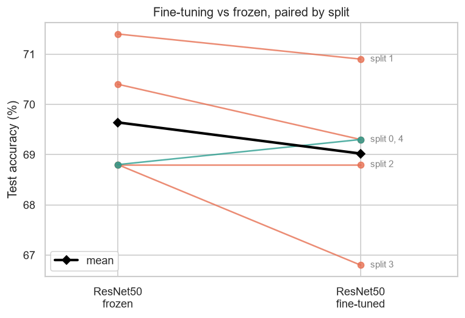
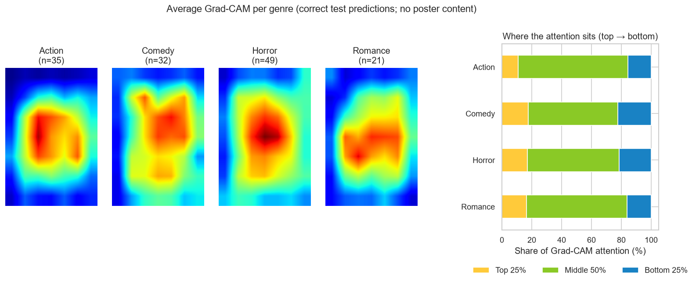
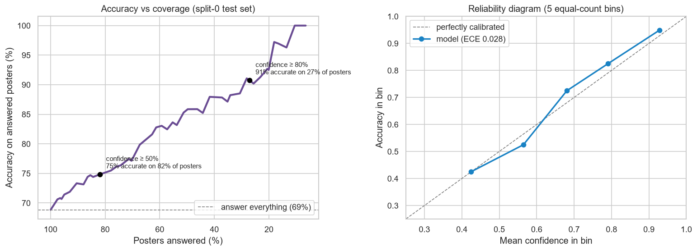

# Movie Genre Classification from Posters

[](https://github.com/RachitSethi2455/movie-genre-poster-classification/actions/workflows/ci.yml)
[](https://colab.research.google.com/github/RachitSethi2455/movie-genre-poster-classification/blob/main/movie_genre_classification.ipynb)


[](LICENSE)

Can a CNN tell a movie's genre from its poster alone? This project classifies posters as **Action, Comedy, Horror or Romance** with transfer learning in PyTorch. It compares four ImageNet-pretrained backbones, then tests whether fine-tuning the best one helps. Every result is **repeated over 5 different train/val/test splits**, because a single 199-image test set is too noisy to rank models.

**Result:** **ResNet50 is the clear winner: 69.6% ± 1.2 test accuracy**, about 2.8× the 25% random baseline. It beats DenseNet121, ResNet18 and VGG16 by 3.5–5.5 points. Regularized fine-tuning changes accuracy by less than 1 point, well within the noise. A [Gradio demo](app.py) classifies any poster you upload.


## Highlights

- **Honest evaluation.** 5 repeated stratified 70/15/15 splits, reported as mean ± sd. Checkpoints are chosen by validation loss and configurations by mean validation accuracy, so test sets are used only for reporting.
- **Fair comparison.** All four backbones get identical frozen-feature training, with only a new linear head trained.
- **Regularized fine-tuning.** Discriminative learning rates, AdamW weight decay, label smoothing, stronger augmentation and early stopping.
- **Fast and light.** Posters are decoded once and cached in memory, so the GPU stays busy. Checkpoints store only the trained layers.
- **Explainability.** Grad-CAM shows what the CNN looks at, and a confidence analysis shows when to trust it: at ≥ 80% confidence it is right 91% of the time.
- **Engineering.** Shared code lives in the [`postergenre/`](postergenre) package, which the notebook, the [demo app](app.py) and the offline [unit tests](tests) all use. CI runs the tests on every push.

## Results

**Stage 1: frozen backbones with a linear head, 5 splits**

| Backbone | Trainable / total params | Val acc | Test acc | Test macro-F1 |
|---|---|---|---|---|
| **ResNet50** | 8.2K / 23.5M | **69.0% ± 3.5** | **69.6% ± 1.2** | **0.684** |
| VGG16 | 16.4K / 134.3M | 66.7% ± 2.5 | 64.1% ± 2.2 | 0.627 |
| DenseNet121 | 4.1K / 7.0M | 65.7% ± 1.9 | 66.1% ± 2.7 | 0.646 |
| ResNet18 | 2.1K / 11.2M | 62.7% ± 3.8 | 65.7% ± 4.1 | 0.641 |

Individual runs range from 61% to 72% test accuracy. ResNet18 alone scored 72.4% on one split and 61.3% on another. That spread is why single-split comparisons can't be trusted on a dataset this small.


**Stage 2: does fine-tuning ResNet50's last block help?**

| | Val acc | Test acc |
|---|---|---|
| ResNet50 frozen | 69.0% ± 3.5 | 69.6% ± 1.2 |
| ResNet50 fine-tuned (regularized) | 69.8% ± 3.3 | 69.0% ± 1.4 |
| **Paired difference** | **+0.8 ± 3.5** (better on 3/5 splits) | **−0.6 ± 1.0** (better on 1/5) |

Regularization fixed the overfitting of the earlier version, cutting training accuracy from 94% to about 86%. But fine-tuning **didn't improve accuracy**: the differences are smaller than the split-to-split noise. The frozen ImageNet features already capture most of what 927 training posters can teach. Following the protocol, the fine-tuned model (higher mean validation accuracy) is the final configuration and powers the demo.



**Per genre: final model, 995 test predictions pooled over the 5 splits**

| Genre | Precision | Recall | F1 |
|---|---|---|---|
| Action | 0.72 | 0.66 | 0.69 |
| Comedy | 0.62 | 0.62 | 0.62 |
| Horror | 0.76 | 0.82 | **0.79** |
| Romance | 0.63 | 0.62 | 0.63 |


## Findings

- **Horror is the most recognisable genre** (F1 0.79). Dark palettes and distinctive typography make it visually consistent.
- **Comedy and Romance get confused with each other.** 26% of romance posters are predicted as comedy and 20% of comedies as romance, since romantic comedies blur the line. Action is most often mistaken for Horror (16%).
- **Bigger isn't better.** VGG16 has 6× more parameters than ResNet50 but ranks last on test, and its validation loss stops improving within the first 5 epochs on every split.
- **The dataset is the bottleneck, not the model.** Fine-tuning brings no measurable gain. More data or richer labels would help more than more training.

## What does the model look at, and when can you trust it?

[`explain_predictions.ipynb`](explain_predictions.ipynb) explains the demo model on its held-out test posters, with no retraining.

**Grad-CAM** highlights the poster regions that drive each prediction. The notebook shows heatmaps on individual test posters. Below are the **averages per genre**, which contain no poster content:



- **The model reads the image, not the title.** 60–74% of the attention falls in the middle half of the poster, against 50% for a uniform map. Action is the most centred (74%); Comedy and Horror draw more on the top and bottom, where titles and taglines sit.
- On individual posters it keys on **couples' faces** for Romance, **dark isolated figures** for Horror, the **armed hero** for Action and **groups of characters** for Comedy.
- Its most confident mistakes are mostly *Romance* posters predicted as *Comedy*, often romantic comedies such as *The Wrong Missy* and *You People*. For films like these, the single-genre label is the real problem.

**Confidence:** the top probability is a useful signal. It is calibrated (ECE 0.028), and when the model reports **at least 80% confidence it is right 91% of the time**, covering about a quarter of posters. Below 40% it is right only 20% of the time, which is close to random.



## Demo app

[`app.py`](app.py) is a [Gradio](https://gradio.app) app. Upload a poster and it returns the probability of each genre, plus a **Grad-CAM heatmap** of the parts of your poster that drove the top prediction.

```bash
pip install -r requirements.txt
python app.py          # opens http://127.0.0.1:7860
```

The demo model is the final configuration trained on split 0, with about 69% test accuracy on that split. [`models/poster_genre.pth`](models) stores only the fine-tuned layers in fp16 (30 MB). The frozen ResNet50 weights are downloaded from torchvision on first start.

## Run the notebook

```bash
git clone https://github.com/RachitSethi2455/movie-genre-poster-classification.git
cd movie-genre-poster-classification
pip install -r requirements.txt jupyter
jupyter notebook movie_genre_classification.ipynb
```

On the first run, the posters are downloaded with [`kagglehub`](https://github.com/Kaggle/kagglehub). The notebook uses a CUDA GPU automatically when one is available, and all 25 training runs take about 20 minutes on an RTX 4050 laptop GPU. The "Open in Colab" badge also works, because the first cell fetches the repo's package.

Run the tests with `pip install pytest && pytest`. They use random-init models and synthetic images, so they need no downloads or GPU.

## Project structure

```
postergenre/
  data.py      Kaggle download, stratified splits, in-memory image cache, transforms
  models.py    backbones + new head, freezing/unfreezing, lightweight checkpoints
  train.py     training loop (best-val-loss checkpoint, early stopping), prediction
  gradcam.py   Grad-CAM heatmaps and overlays
models/        demo checkpoint + model card (written by the notebook)
tests/         offline unit tests
app.py         Gradio demo
movie_genre_classification.ipynb   training and evaluation (5 splits)
explain_predictions.ipynb          Grad-CAM and confidence analysis of the demo model
```

## Dataset

[Four-Genre Movie Poster Images](https://www.kaggle.com/datasets/zulkarnainsaurav/four-genre-movie-poster-images) (Kaggle, Apache 2.0) contains 1,325 IMDB posters (Action 337, Comedy 321, Horror 398, Romance 269). The posters are not included in this repo.

## Next steps

- **Multi-label genres.** Real movies are often several genres at once (e.g. romantic comedy), which also explains the Comedy↔Romance confusion.
- **Poster-specific signals**, such as OCR'd title text, colour statistics and face counts, alongside the CNN features.
- More data. With about 900 training images, the model is limited by data rather than capacity.

## Tech

Python · PyTorch · torchvision · Gradio · scikit-learn · pandas · seaborn · matplotlib · pytest · GitHub Actions

## License

Code is released under the [MIT License](LICENSE). The dataset keeps its own Kaggle license, and the posters' copyrights belong to their owners.
